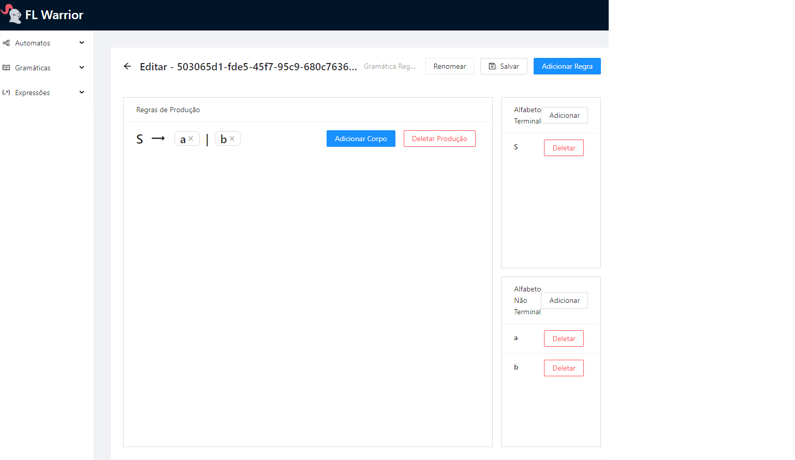

# FLWarrior

<p align="center">
    
</p>

#### Formal Languages Class Project

This project has is divided between **back-end** and **front-end**.

The back-end is under the `lib/` folder and is used by the front-end to implement the logic of Grammars, RegularExpressions, and Machines. Each of these, in the front-end, have their own `index.tsx` and edit `pages.tsx`. The front-end is located in the `pages/` folder.

We also use the browser-integrated database to store information about the languages, which makes this project esclusively client-sided. This is located in the `database/` folder.

## Running

You will need [NodeJS v14.x or higher](https://github.com/npm/cli)
```
npm install # Installs dependences
npm test # runs tests
npm run start # runs (be patient)
```

### Interface capture:
<p align="center">
    
</p>
